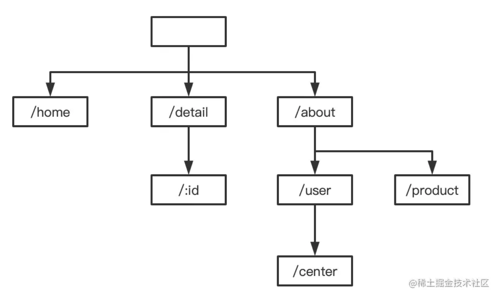
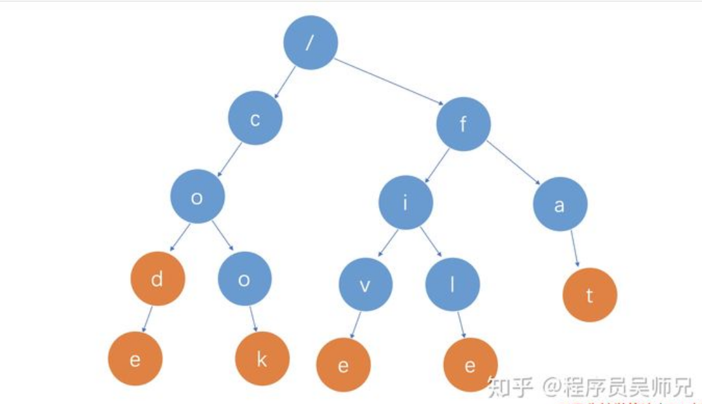

> 前缀树的作用：快速判断路由表中是否包含了此路由条目； 对于动态路由也可以匹配上

# 一、基础知识

### 1. 什么是动态路由？

- 一个路由条目可以模糊匹配出多个具体的路由。一条路由规则可以匹配某一类型而非某一条固定的路由

​	比如 有动态路由：`/p/:hello/dox` 其中的 `:` 表示匹配一个单词(hello没有实际意义，是对:的标识)。

​	他可以匹配 `/p/python/dox`， `/p/ycb/dox`

- 匹配符

  - “：” ： 模糊匹配，只能匹配一个字符

  - “*” ： 通配符， 可以匹配多个字符 `/p/python/*filepath` 可以匹配所有以 `/p/python/`开头的pattern

    ​		比如 `/p/python/js.go` `/p/python/11/22/dox` 注意这里有多个路径分支也可以哟

### 2. Map存储路由的弊端？

- 键值对的存储的方式，只能用来索引静态路由

  如果是上面的动态路由，需要将一个个的key拿出来与路径进行匹配对比，不现实

# 二、前缀树

## 1. 前缀树是什么？

- 【是什么？】 一棵树，对于每个节点它的子节点都有相同的前缀。 比如下面的树，可以表示如下的路由

  /home
  /detail/1
  /about/user/center
  /about/product

  

[浅析动态路由之前缀树与正则匹配 - 掘金](https://juejin.cn/post/7025476448471236615)

## 2. 前缀树的实现

### 1）插入节点

**1）插入节点构造前缀树**

Trie树的插入操作很简单，其实就是将单词的每个字母逐一插入Trie树。插入前先看字母对应的节点是否存在，存在则共享该节点，不存在则创建对应的节点

比如要插入新单词`cook`，就有下面几步：

- 插入第一个字母 `c`，发现 `root` 节点下方存在子节点 `c`，则共享节点 `c`
- 插入第二个字母 `o`，发现 `c` 节点下方存在子节点 `o`，则共享节点 `o`
- 插入第三个字母 `o`，发现 `o` 节点下方不存在子节点 `o`，则创建子节点 `o`
- 插入第三个字母 `k`，发现 `o` 节点下方不存在子节点 `k`，则创建子节点 `k`
- 至此，单词 `cook` 中所有字母已被插入 Trie树 中，然后设置节点 `k` 中的标志位，标记路径 `root->c->o->o->k`这条路径上所有节点的字符可以组成一个单词`cook`

**2）标志位**

- 路径的最后一个元素对应的node应该有个**标志位**，标识这是最后一个节点，标识的内容是整个路径。 除此之外所有节点标识位为空

比如 整棵树表示了 code  cod 等等那么对应在最后一个节点 (e d)会有一个标志：(路径c-o-d-e c-o-d)，表明这是对应的路径的最后一个节点。

当有一个串想要来查找是否在前缀树中有记录，比如 "co" 串，查找时候一路都能匹配，当匹配到 "o"时，发现"o"节点的标识位置为空，说明匹配失败，trie树没有表示"co"这个路径

(标识位是为了防止能够匹配最后一个字母以前的所有内容，但是实际上没有收纳这个字符串的情况)

### 2）查找路径

按层匹配树中的节点BFS， 

- 匹配失败：
  1. 某层没有对应的node 
  2. 自己已经到最后一个单词，并且在Trie中已经匹配到了，但这个匹配到的node标志位为空
  3. 当前需要匹配的自己的字符，已经超过了前缀树的高度。 （但对于动态路由来说，如果有*通配符，则可以超过高度）