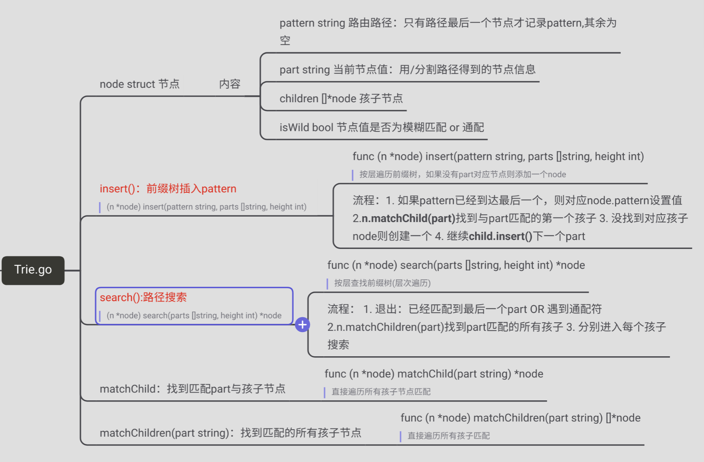
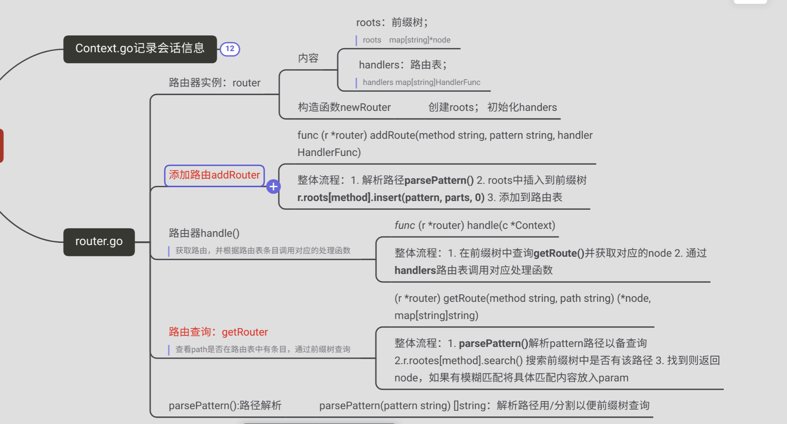

[toc]


# 一. Trie前缀树的实现




```go
package gee

// 【node】
type node struct {
	pattern  string //整个路由， 只有pattern结束的节点才有这个值，其余节点为空
	part     string //当前节点
	children []*node
	isWild   bool //是否是模糊节点
}

// 【insert构建Trie】
func (n *node) insert(pattern string, parts []string, height int) *node {
	// 1. 如果pattern已经到达最后一个，则对应node.pattern设置值
	if len(parts) == height {
		n.pattern = pattern //node能进来就是已经和part匹配上了的，不需要考虑没有匹配上的情况
		return n
	}
	// 2.n.matchChild(part)找到与part匹配的第一个孩子
	part := parts[height]
	child := n.matchChild(part)
	// 3. 没找到对应孩子node则创建一个, 并将这个child节点添加到node的孩子节点中
	if child == nil {
		child = &node{
			part:   part,
			isWild: part[0] == ':' || part[0] == '*',
		}
		n.children = append(n.children, child)
	}
	// 4. 继续child.insert()下一个part
	return child.insert(pattern, parts, height+1)
}

// 【search搜索pattern】
func (n *node) search(pattern string, parts []string, height int) *node {
	// 1. 退出:已经到达pattern最后 OR 遇到通配符，都会终止搜索
	if len(parts) == height || n.part[0] == '*' {
		// 检查最后一个节点是否是终止节点
		if n.pattern != "" {
			return n
		}
		return nil
	}
	// 2. 按层查找
	part := parts[height]
	children := n.matchChildren(part)
	for _, child := range children {
		// 3. DFS 搜索
		res := child.search(pattern, parts, height+1)
		if res != nil {
			return res
		}
	}
	return nil
}

// 【matchChild匹配part与孩子节点】
func (n *node) matchChild(part string) *node {
	for _, child := range n.children {
		if child.part == part || child.isWild { //是模糊匹配
			return child
		}
	}
	return nil
}

// 【matchChildren匹配part的所有孩子】
func (n *node) matchChildren(part string) []*node {
	children := []*node{}
	for _, child := range n.children {
		if child.part == part || child.isWild {
			children = append(children, child)
		}
	}
	return children
}

```


# 二、Router.go



Router每个函数都关于前缀树有变化

```go
package gee

import (
	"net/http"
	"strings"
)

// 【router】
type router struct {
	// 前缀树；路由表
	roots    map[string]*node
	handlers map[string]HandlerFunc
}

func newRouter() *router {
	return &router{map[string]*node{}, map[string]HandlerFunc{}}
}

// 【addRouter】路由添加
func (r *router) addRouter(method, pattern string, handler HandlerFunc) {
	// 1. 解析路径parsePattern()
	parts := parsePattern(pattern)
	// 2. roots中插入到前缀树
	if _, ok := r.roots[method]; !ok {
		r.roots[method] = &node{} //根节点为空
	}
	r.roots[method].insert(pattern, parts, 0) //get方法是0层的根节点
	// 3. 添加到路由表
	key := method + "-" + pattern
	r.handlers[key] = handler
}

// 【getRouter】路由查询
// 返回查询到的树中的节点， 和模糊查询的值 {lang: /hello}
func (r *router) getRoute(method string, pattern string) (*node, map[string]string) {
	// 1. parsePattern()解析pattern路径以备查询
	searchParts := parsePattern(pattern)

	// 2.r.rootes[method].search() 搜索前缀树中是否有该路径
	root, ok := r.roots[method]
	if !ok {
		return nil, nil
	}
	node := root.search(pattern, searchParts, 0)
	// 3. 找到则返回node，如果前缀树中有模糊匹配将具体匹配内容放入param
	if node != nil {
		params := map[string]string{}
		parts := parsePattern(node.pattern)
		for index, part := range parts {
			if part[0] == ':' {
				params[part[1:]] = searchParts[index]
			}
			if part[0] == '*' { //通配符匹配*后面所有部分
				params[part[1:]] = strings.Join(searchParts[index:], "/")
			}
		}
		return node, params
	}

	return nil, nil
}

// 【handle】路由选择
func (r *router) handle(c *Context) {
	// 整体流程：1. 在前缀树中查询getRoute()并获取对应的node
	if node, params := r.getRoute(c.Method, c.Path); node == nil {
		c.String(http.StatusNotFound, "404 Note FOUND!")
	} else {
		c.Params = params //模糊匹配的值赋值给会话Context
		//因为 c.Path是请求的具体路由= /p/python   n.patten是树中注册的动态路由
		key := c.Method + "-" + node.pattern
		// 2. 通过handlers路由表调用对应处理函数
		r.handlers[key](c)
	}

}

// 【parsePattern】路径解析
func parsePattern(pattern string) (parts []string) {
	temps := strings.Split(pattern, "/")
	for _, temp := range temps {
		if temp != "" {
			parts = append(parts, temp)
			if temp[0] == '*' { //发现通配符，则只加入一个*
				break
			}
		}
	}
	return
}

```


# 三、Context的变化

Context作为上下文新增了**param**记录 请求路径与前缀树路径中的模糊匹配

如 `/p/:lang`匹配  `/p/hello` 则Params = {lang:"/hello"}

```go
// Context对象
type Context struct {
	// origin
	Req    *http.Request
	Writer http.ResponseWriter
	// 常用属性
	Method string
	Path   string
	Params map[string]string // 记录当前请求内容
	// 状态码
	StatusCode int
}

func (c *Context) Param(key string) string {
	return c.Params[key]
}
```


# 四、测试

main.go同上一节的


```shell
$ curl "http://localhost:9999/hello/geektutu"
hello geektutu, you're at /hello/geektutu

$ curl "http://localhost:9999/assets/css/geektutu.css"
{"filepath":"css/geektutu.css"}
```


## 单元测试

```go
```

