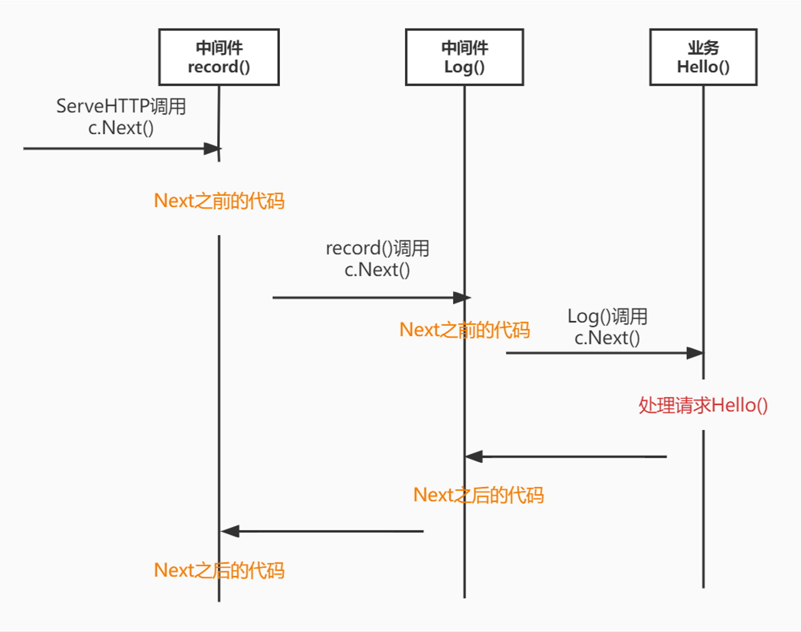

# 一、中间件是什么？

> 非业务类的组件。
>
> 路由handlerFunc()就是业务类，非业务类组件就是与业务无关的功能。比如想在handler之前记录当前时间，在handler之后说明已经执行完毕，这些都是非业务类功能


用来解耦功能(与业务无关的功能)与业务(handle处理请求)

## 解耦


### 耦合

当遇到想在程序运行之前说明当前时间, 则要进行如下代码

```go
//业务处理
func helloWorldHandler(w http.ResponseWriter, r *http.Request) {
	record(r.URL.Path)
    handle(w, r)//业务功能
}

func record(path string)  {
	fmt.Println(time.Now().Format("3:04:05 PM Mon Jan") + " " + path)
}
```

record()是在handler的业务功能之前进行的。 每次写handler之前，都要把r.Path传入Record， 如果要添加多个路由，那么每次在写handler的核心业务之前都要调用record(r.Path)

- 出现了业务handle(w, r) 与 record(r.Path)仅仅绑定在一起的耦合情况

### 解耦

- 下面代码中 record(w, r)已经解开了 与业务handle()的部分耦合

- 开发人员在写每个Handler时，**只需要考虑如何回复请求(handle)，在调用handle()之前只需要调用功能函数Record()**。

  而对于Record()对开发人员来说是透明的，看不见内部的，record可以添加删除任意属于record的功能

```go
func helloWorldHandler(w http.ResponseWriter, r *http.Request) {
	record(w ,r)//记录(功能代码) : 与业务逻辑无关
	fmt.Fprintf(w, "Hello World !")
}

func record(w http.ResponseWriter, r *http.Request)  {
	path := r.URL.Path
	method := r.Method
	fmt.Println(time.Now().Format("3:04:05 PM Mon Jan") + " " + method + " " + path)
}
```

**问题?**

handler里面还是有record()这个功能代码，能不能让handler里只有handle()这个因为代码呢？


# 二、中间件的设计

> 设计需要考虑的事情是： 如何让业务(handle())与非业务功能彻底分离


### 使用效果

看看分离后的使用效果, 

下面注册路由和没有record函数时候一样，在注册路由之前，调用AddBeforeHandle完成了record的执行。

彻底实现了 业务(handle())  与 功能(record) 的分离

```go
r := gee.New()
e.AddBeforeHandle(record)//record是handlerfunc类型
e.GET("/hello", Hello)
```


### 实现

router.AddBeforeHandle(record)如何将业务功能分离的呢？

- 1. 将record记录在Engine里面

```go
func (e *Engine) AddBeforeHandle(record) {
    e.handlers = record
}
```

- 2. 在拦截到请求后执行ServeHTTP时，**在req进行路由选择之前，查询Engine是否有handlers，如果有则执行里面的函数**

```go
func (e *Engine) ServeHTTP(w, r) { 
    if e.handlers != nil {
        record(w,r)
    }
    handle(w,r)//r="hello", 此时调用r对应的路由 Hello
}
```

经过 将record记录在Engine中做到了 业务功能分离


### 拓展

上面只实现了一个record-> 如果想要在handle()之前再进行其他操作呢？在handle()之后再进行其他操作呢？

可以这样简单的操作：

- 1. 【执行多个函数】将e.handlers改成一个数组，存储多个功能函数，在执行业务之前全部执行一遍
- 2. 【在handle之后执行】在Engine中添加新的属性，用来存储在handle()执行完毕之后执行的函数

```go
func (e *Engine) ServeHTTP(w, r) { 
    //handle()执行前的函数： record(w,r)， Log(w, r)，....
    for _, before := e.beforeHandlers {
        before(w,r)
    }
    handle(w,r)//r="hello", 此时调用r对应的路由 Hello
    //handle()执行完之后执行的内容
    for _, after := e.afterHandlers {
        after(w,r)
    }
}
```


# 三、框架中中间件的实现

框架中间件最厉害的地方就是： **不分离前后**


上面我们设计的中间件，对于handle()前后执行的，需要分开编写：

e.beforeHandlers e.afterHandlers


框架如何做到不分离前后的呢？

### 使用效果

> 下面是Gin框架实现中间件，简化了一些不重要的地方

上面我们简单地将record()等中间件函数存储在了Engine里面，但通常会存储在Context里面(这里暂时不关心如何存进去的)


- 1. 首先，Gin框架类似 注册中间件的方式与我们设计的类似

```go
r := gee.New()
r.Use(record, Log) // 将中间件放入到Context中去
r.GET("/", Hello)
```

​	Use()的作用是将中间件注册到 c.Handlers []HandlerFunc 数组中, 以便整个会话过程访问

- 2. 实例中对req的处理

```go
func (e *Engine) ServeHTTP(w, r) {
    c := newContext()
    e.HandleHTTPReq(c)
}
```

### 实现

Context添加了：

- 两个属性`handlers []HandlerFunc、index int`： 前者存储路由与中间件，后者是handlers的索引

- 添加了一个函数Next() :核心函数

---


- 1. 下面，将中间件与业务函数handle()都添加到c.handlers中了，且**顺序是先中间件，后handler**

```go
func (e *Engine) HandleHTTPReq(c *Contex) {
    1. 路由查找Req，将Req对应的HandlerFunc：Hello 添加到c,Handlers里面
    	注意：之前main.go中已经添加了所有的中间件
    	c.Handlers == [record, Log, Hello]
    2. 执行 c.Next()
}
```

- 2. 核心在于Next()

#### Next()

上面ServeHTTP在newContext时，同时将c.index = -1赋值

```go
func (c *Contex) Next() {
    c.index++
    //遍历执行所有中间件与业务函数
    for c.index < len(c.handlers) {
        c.handlers[c.index](c) //recor(c), Log(c), Hello(c)的执行顺序
        c.index++
    }
}
```


同时，对于Log这个中间件的源代码如下：

```go
func Log() HandlerFunc {
    ...
    return func(c *Context){
       	Part Log1...
        c.Next()
        PartB Log2...
    }
}
```

假设还有record()已经的升级版本

```go
func record() {
    Part R1...
    c.Next()
    PartB R2...
}
```


上述的执行情况是： 

1. ServeHTTP执行c.Next() : index = 0
2. 0 < 3, record(c), **执行Part R1**, 
3. 进入【**record()】c.Next()**, c.index++ => 1
4. 1 < 3, Log(c), **Part Log1...**， 进入**【Log()】c.Next()** c.index++ => 2

5. 2 < 3, Hello(c),  //假设Hello输出一个Hello。 Hello执行完毕返回
6. 返回到 **【Log()】c.Next()** ， 继续执行 PartB Log2...， 执行完毕返回
7. 返回到【**record()】c.Next()**， 继续执行 PartB R2，
8. 最后全部执行完毕

总体执行顺序是: `Part R1 -> Part Log1... -> Hello(c) -> Part Log2...->Part R1`




#### Middleware()

从上面可以看出：

Next() & 中间件函数的写法，

- 保证了所有功能的顺序执行 c.Next()

- 同时保证了功能函数不区分 beforeHandler afterHander

  ```go
  fun MiddleWare() HandlerFunc{
      beforeHandlerPart...//想要在handler之前执行的内容
      c.Next()
      afterHandlerPart...//想要在业务函数之后执行的内容
  }
  ```

  


# 四、参考

[Golang Web入门（3）：如何优雅的设计中间件](https://juejin.cn/post/6844904135049871367)
