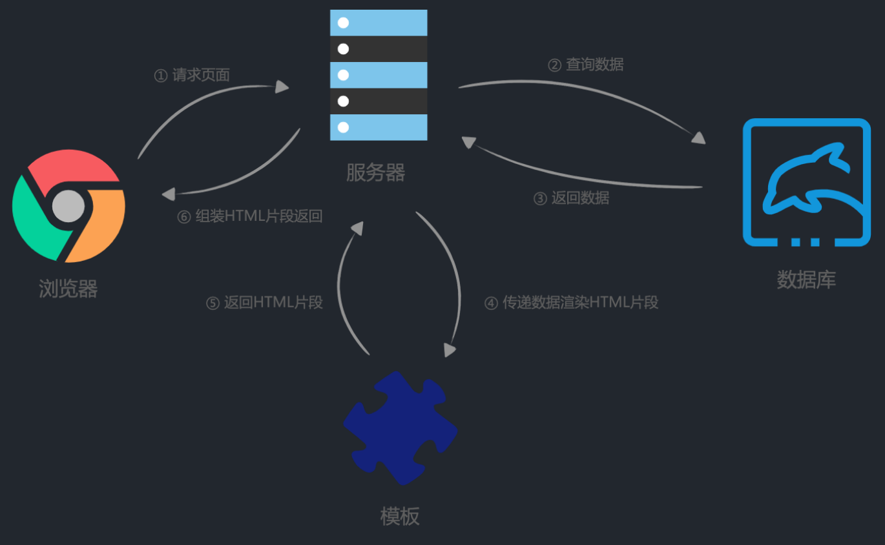
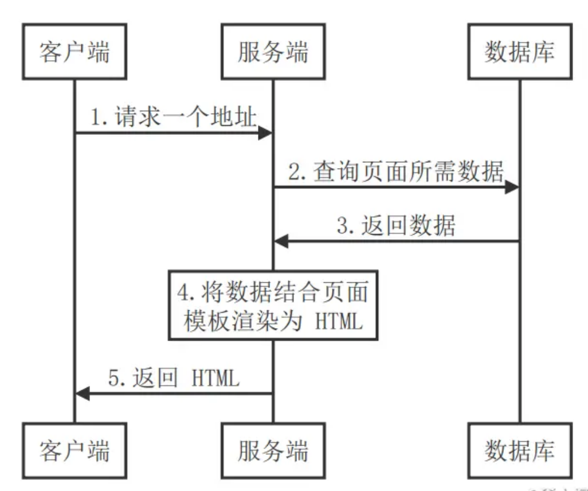

>  Web 框架如何支持服务端渲染的场景


- [x] 传统渲染方式：[渲染](https://zhuanlan.zhihu.com/p/442574339)

- [x] 现代渲染方式：为什么要在客户端and服务器都渲染执行一遍代码

  [现代渲染方式](https://juejin.cn/post/7082711258952105992)

# 一、模板在渲染中起的作用


### **1 后端开发中的流程**： 

> （等Go后端开发代码写的时候来补充这部分）

1. Client请求页面


### **2 传统服务器渲染**

> 整个渲染由服务器完成，前端直接展示服务器传来的已经渲染好的HTML页面





2.1 **渲染流程**：

1. Client发起请求；
2. Server从数据库查询数据
3. 数据库返回数据
4. Server 用 数据 结合页面模板渲染为 HTML
5. Server将渲染好了的HTML页面返回给Client
6. Client直接展示HTML页面


2.2 优缺点

优点：有利于SEO，有利于搜索引擎提取页面的关键信息(提取需要依靠HTML)

缺点：

1. 前后端耦合，开发困难
2. 前端没有开发的余地
3. 服务端需要生成HTML页面，压力较大


### 3 客户端渲染

> 渲染工作由客户端完成， Server只需要向客户端返回所需要的数据即可。 实现了前后端分离


**优缺点**：

优点：前后端分离

缺点：

1. 不利于SEO，就是说不利于搜索引擎直接获取页面内容，页面内容是需要JavaScript生成的，不是直接HTML。

2. 首屏显示慢，客户端获取到数据后需要用JS显示页面，导致用户等待时间长


### 4 现代服务器渲染

> 4服务端负责渲染好首屏的HTML页面内容，客户端直接展示；
>
> 之后的页面交互由客户端负责渲染


## 参考

[从传统服务端渲染到客户端渲染再到现代化的服务端渲染](https://juejin.cn/post/7082711258952105992#heading-1)

[彻底理解服务器端渲染](https://github.com/yacan8/blog/issues/30)


# 二、Go原生库实现模板渲染

### 1. 模板渲染步骤

**渲染模板主要有三步**：

1. **创建** 模板对象 `t := template.New("hello.html")`
2. **加载** 模板变量的内容 `t := t.Parse(tmpl)`
3. **渲染** 将内容渲染模板到... `t.Execute(w, "Hello, Go Template!")`


### 2. **Text模板渲染**

下面

1. 创建模板对象 “test”

2. 解析 模板变量`"The name for student {{.ID}} is {{.Name}}"` 同样也可以解析file
3. 将内容 `stu := Student{0, "jason"}` 渲染到模板对象中去，并输出到os.Stdout

```go
// 提供给模板中的数据：数据一定要export出来
type Student struct {
	ID   uint
	Name string
}

func main() {
	// 1. 创建传递给模板的内容结构体
	stu := Student{0, "jason"}
	// 2. 创建“test”模板对象，并解析变量模板中的字符串
	tmpl, err := template.New("test").Parse("The name for student {{.ID}} is {{.Name}}")
	if err != nil {
		panic(err)
	}
	// 3. 将内容结构体传渲染模板，到达标准输出
	err = tmpl.Execute(os.Stdout, stu)
	if err != nil {
		panic(err)
	}
}
```


```go
func templateHandler(w http.ResponseWriter, r *http.Request) {
    //模板变量
	tmpl := `<!DOCTYPE html>
<html>
    <head>
        <meta http-equiv="Content-Type" content="text/html; charset=utf-8"> <title>Go Template Demo</title>
    </head>
    <body>
        {{ . }}
    </body>
</html>`

	// 1. 创建 模板对象
	t := template.New("hello.html")
	// 2. 解析 加载模板变量
	t, _ = t.Parse(tmpl)
	// 3. 渲染内容模板到....
	t.Execute(w, "Hello, Go Template!")//渲染内容  "Hello, Go Template!"到模板 输出到 w
}
```


参考文献

[Go 模板渲染](https://morven.life/posts/golang-template/)


模板变量


